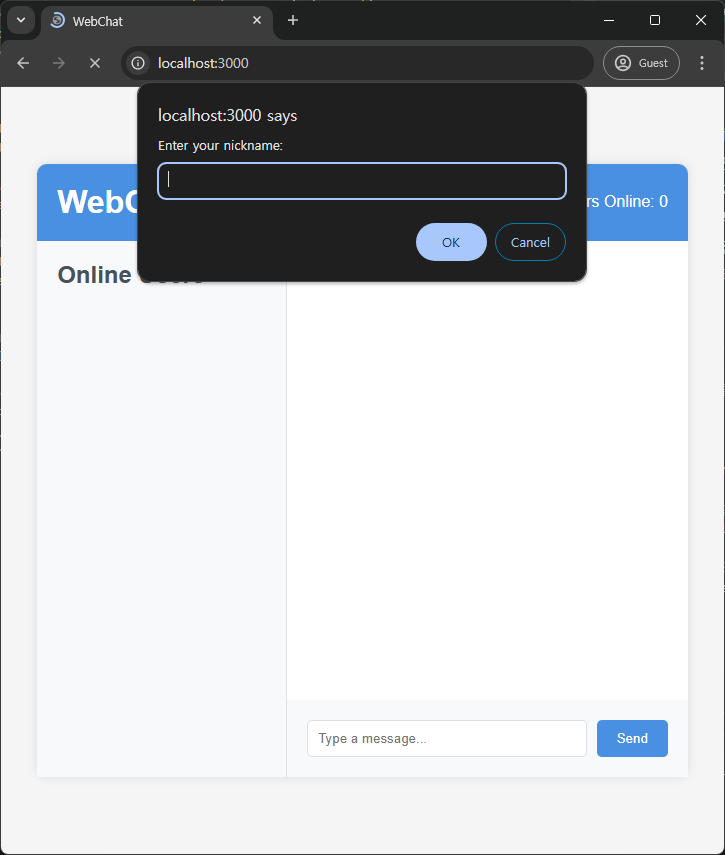
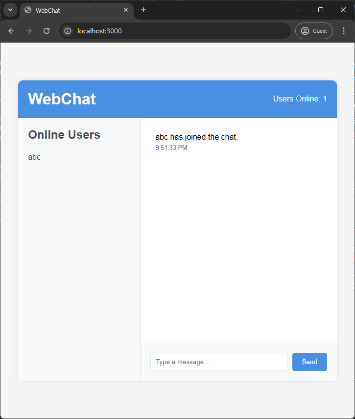

# OneRoomWebChat (Real-time Chat for One-Room Housing)

## 📝 Project Overview
OneRoomWebChat is a real-time chat application designed for communication between landlords and tenants of one-room housing.
It facilitates efficient communication through an intuitive UI and real-time message delivery.

## 📚 Documentation
[Project Documentation](docs/project_specification.md)

## Web Development Guide for Beginners
[Web Development Guide for Beginners](docs/web_development_guide_for_beginners_eng.md)

## 🛠 Tech Stack
### Backend
- Java 11
- Spring Boot 2.7.0
- Spring WebSocket
- Maven
- Lombok

### Frontend
- HTML5
- CSS3
- JavaScript (ES6+)
- Thymeleaf

## ⚙ Key Features
- WebSocket-based real-time 1:1 chat
- Intuitive UI/UX
- Emoji support
- File attachment functionality
- Message delivery status
- Real-time timestamp

## 🚀 Installation and Setup

### Prerequisites
- Java 11 or higher
- Maven
- IDE (Eclipse/IntelliJ/VS Code)

### Running the Application

#### Method 1: Using IDE
1. Open the project in your IDE
2. Navigate to `src/main/java/com/chat/Application.java`
3. Right-click and select 'Run' or press F5
4. The application will start on `http://localhost:8080`

#### Method 2: Using Command Line
```bash
# Clone repository
git clone https://github.com/yourusername/OneRoomWebChat.git

# Navigate to project directory
cd OneRoomWebChat

# Build with Maven
./mvnw clean package

# Run application
java -jar target/one-room-web-chat-1.0-SNAPSHOT.jar
```

### Access the Application
Once started, access the application at:
- URL: `http://localhost:8080`
- WebSocket endpoint: `ws://localhost:8080/ws`

## 💡 Project Structure
```
OneRoomWebChat/
├── src/
│   ├── main/
│   │   ├── java/
│   │   │   └── com/chat/
│   │   │       ├── Application.java
│   │   │       ├── controller/
│   │   │       ├── model/
│   │   │       └── config/
│   │   └── resources/
│   │       ├── static/
│   │       │   ├── js/
│   │       │   └── css/
│   │       └── templates/
└── pom.xml
```

## 🎯 Development Goals
1. Implementation of user-friendly UI/UX
2. Optimization of real-time data processing
3. Building a stable message delivery system
4. Design of scalable architecture

## 📱 Screenshots



## 👨‍💻 Developer Information
- Name: Woobin Kim
- Email: louiswoobinkim0210@gmail.com
- GitHub: [@Ifus0210](https://github.com/Ifus0210)

## 📜 License
This project is licensed under the MIT License.

