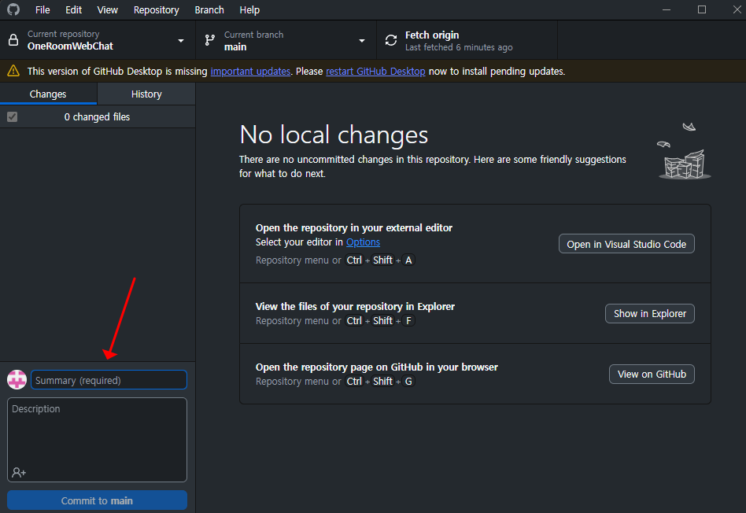

## md 파일 작성 시 확인하는 방법
1. Ctrl + Shift + V(MacOS: Command + Shift + V) 를 눌러서 미리보기 확인
2. 미리보기 확인 후 미리보기 창 닫기

## Command Palette 
1. Ctrl + Shift + P(MacOS: Command + Shift + P) 를 눌러서 Command Palette 열기
2. 명령어 입력 후 엔터

또는 

1. Ctrl + P(MacOS: Command + P) 를 누르기
2. '>' 입력 후 명령어 입력 후 엔터 누르기

## JAVA 프로젝트 디버깅 모드
1. 프로젝트 폴더 우클릭 후 Run As -> Debug As 선택

또는

1. 단축키 F5 누르기

## Github 에 결과물 업로드 방법
1. Github desktop 열기
2. 커밋 메시지 입력 후 Commit 버튼 누르기

3. Push/Publish 버튼 누르기